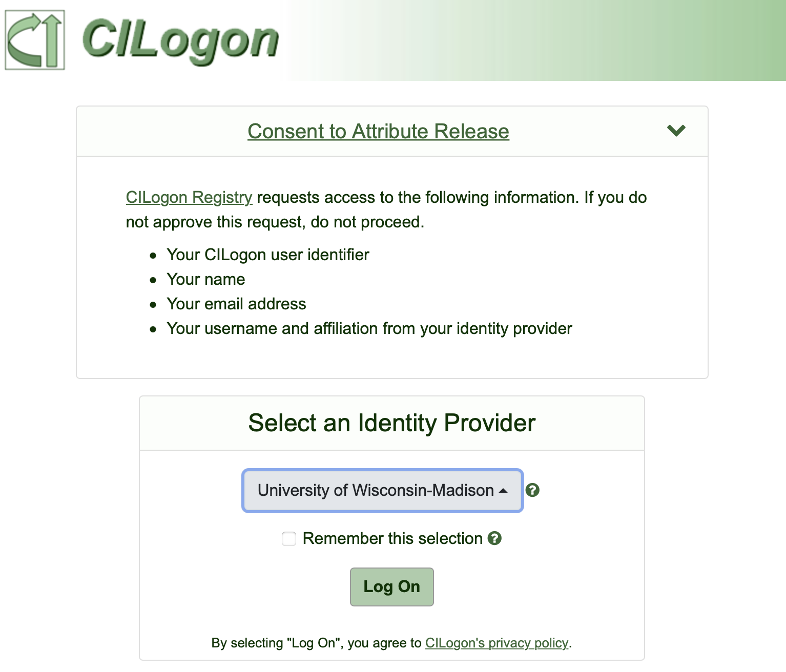
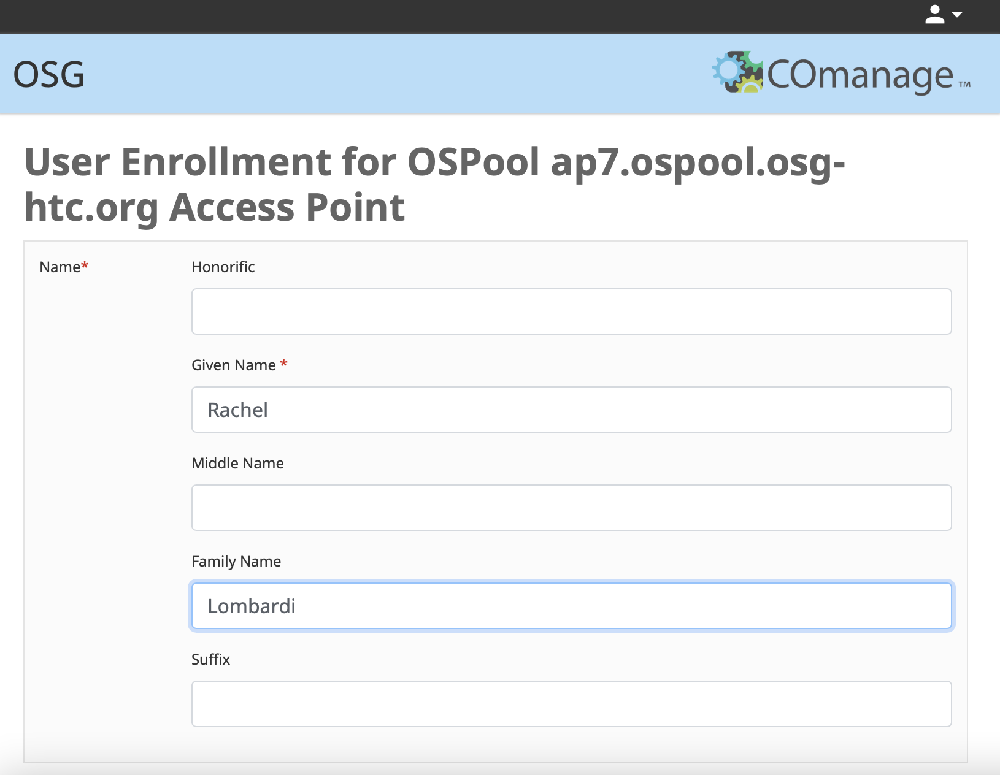
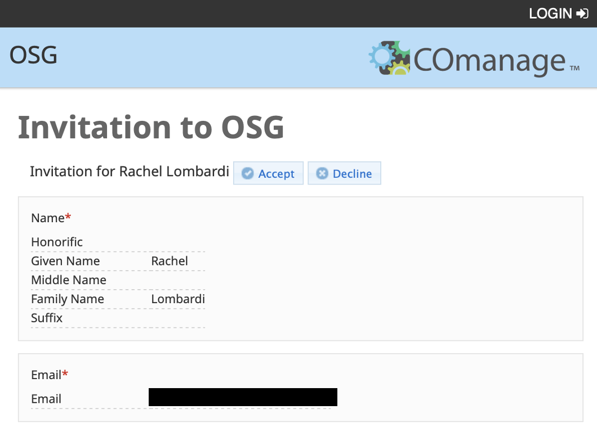
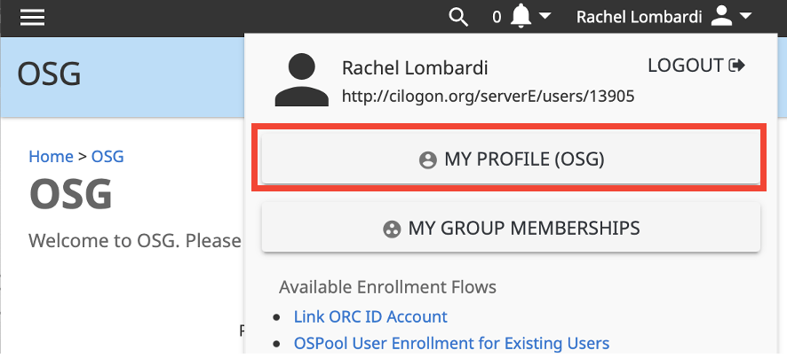
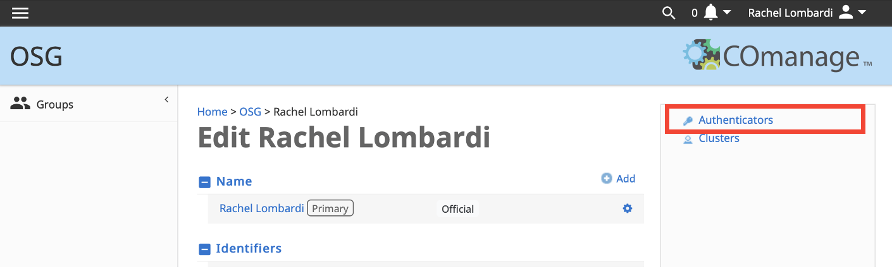
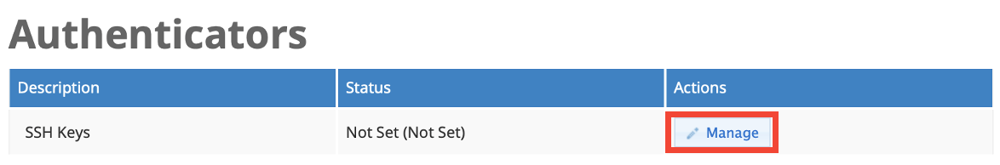
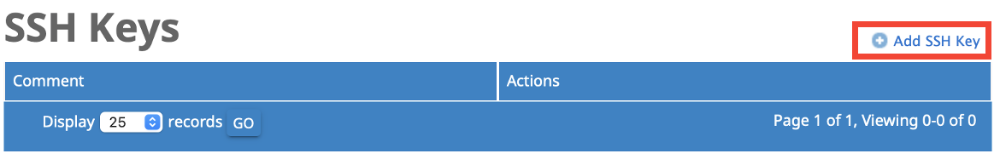

[title]: - "OSPool ap7.ospool.osg-htc.org Access Point"
[TOC]


*This guide is for users who were **notified by a member of the OSG team** that they will be working on the `ap7.ospool.osg-htc.org` Access Point.*

The major steps to getting started with this access point are:

* applying for an OSPool `ap7.ospool.osg-htc.org` Access Point account 
* have your account approved by an OSG Team member
* logging into `ap7.ospool.osg-htc.org`

This guide will discuss how to apply for an account and login to `ap7.ospool.osg-htc.org`.

## Request Access to the OSPool `ap7.ospool.osg-htc.org` Access Point
To request access to `ap7.ospool.osg-htc.org`, submit an application using the following steps:

1. Go to the account [registration page](https://registry.cilogon.org/registry/co_petitions/start/coef:297). You will be redirected to the CILogon sign in page. Select your institution and use your institutional credentials to login. You will use these credentials later to login so it is important to remember the institution you use at this step. 
   
   {: .border .border-5 }
   
   
   
   If you have issues signing in using your institutional credentials, contact us at [support@osg-htc.org](mailto:support@osg-htc.org).


1. Once you sign in, you will be redirected to the "User Enrollment for OSPool ap7.ospool.osg-htc.org Access Point" page. Click "Begin" and enter your name and email address in the following page. In many cases, this information will be automatically populated. If desired, it is possible to manually edit any information automatically filled in. Once you have entered your information, click "SUBMIT".

   {: .border .border-5 }
   

3. After submitting your application, you will receive an email from [registry@cilogon.org](mailto:registry@cilogon.org) to verify your email address. Click the link listed in the email to be redirected to a page confirm your invitation details. Click the "ACCEPT" button to complete this step.

   {: .border .border-5 }
   
   

## Account Approval by a Research Computing Facilitator

Once OSG staff receive your email verification, a Research Computing Facilitator will contact you within one business day to arrange a short consultation and introduction to OSG resources. During this meeting, our staff will provide personalized start-up guidance per your specific computational research goals and activate your account.

Following the meeting, the Facilitator will approve your account and add your profile to any relevant OSG ‘project’ names. Once your account is ready, the Facilitator will email you with your account details including the 'username' you will use to log in to the `ap7.ospool.osg-htc.org` access point. 


## Log in

Once your account has been added to the `ap7.ospool.osg-htc.org` access point, you will be able to log in using a terminal or SSH program. Logging in requires authenticating your credientials using one of two options: __web authentication__ or __SSH key pair authentication__. Additional information on this process will be provided during and/or following your discussion with a Research Computing Facilitator.


### Option 1: Log in via Web Authentication

Logging in via web authentication requires no preparatory steps beyond having access to an internet browser. 

To authenticate using this approach: 

1. Open a terminal and type `ssh username@ap7.ospool.osg-htc.org`, being sure to replace `username` with your `ap7.ospool.osg-htc.org` username. Upon hitting enter, the following text should appear with a unique, but similar, URL: 

   ```
   Authenticate at
   -----------------
   https://cilogon.org/device/?user_code=FF4-ZX6-9LK
   -----------------
   Type 'Enter' when you authenticate.
   ```

2. Copy the `https://` link, paste it into a web browser, and hit enter.  

3. You will be redirected to a new page where you will be prompted to login using your institutional credentials. Once you have done so, a new page will appear with the following text: "You have successfully approved the user code. Please return to your device for further instructions."

4. Return to your terminal, and type 'Enter' to complete the login process. 


### Option 2: Log in via SSH Key Pair Authentication

It is also possible to authenticate using an SSH key pair, if you prefer. Logging in using SSH keys does not require access to an internet browser to log in into the OSG Access Point, `ap7.ospool.osg-htc.org`. 

The process below describes how to upload a public key to the registration website. It assumes that a private/public key pair has already been generated. If you need to generate a key pair, see the "Step 1: Generate SSH Keys" section of this [OSG guide](https://support.opensciencegrid.org/support/solutions/articles/12000027675-generate-ssh-keys-and-activate-your-osg-login). 

1. Return to the [Registration Page](https://registry.cilogon.org/registry/co_petitions/start/coef:297) and login using your institutional credentials if prompted.

2. Click your name at the top right. In the dropdown box, click "My Profile (OSG)" button.

   {: .border .border-5}
   

3. On the right hand side of your profile, click "Authenticators" link.

   {: .border .border-5 }
   

4. On the authenticators page, click the "Manage" button.

   {: .border .border-5 }
   

1. On the new SSH Keys page, click "Add SSH Key" and browse your computer to upload your public SSH key.
   
   {: .border .border-5 }
   

You can now log in to Access Point, ap7.ospool.osg-htc.org from the terminal, using `ssh username@submit6.chtc.wisc.edu`. When you log in, instead of being prompted with a web link, you should either authenticate automatically or be asked for your ssh key passphrase to complete logging in.
## Get Help

For questions regarding logging in or creating an account, contact us at  [support@osg-htc.org](mailto:support@osg-htc.org).
